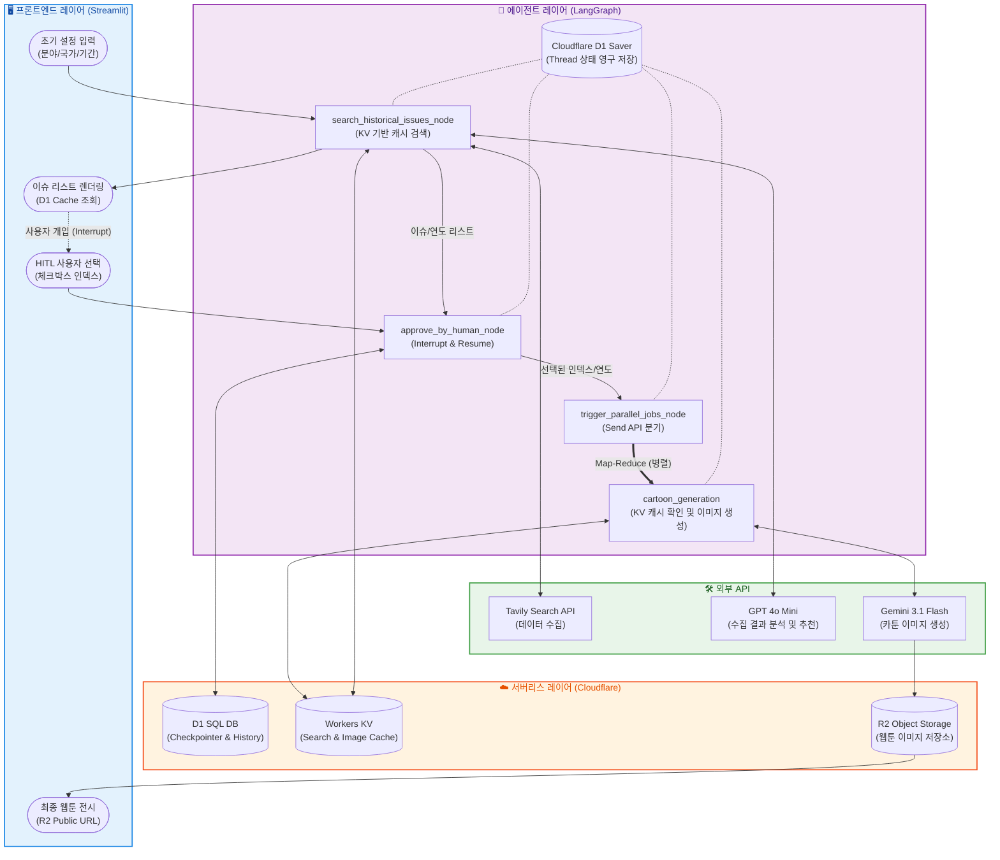

# 🌍 Geo Master Agent v3.1

LangGraph와 Google GenAI SDK를 활용하여 특정 국가의 분야별 핵심 히스토리를 분석하고, 이를 바탕으로 한글 텍스트가 포함된 고품질 교육용 웹툰/삽화를 자동 생성하는 AI 에이전트입니다.

## 1. 에이전트 개요

- **이름**: 지오 마스터 에이전트 (Geo Master Agent)
- **목적**: 국가 간의 다양한 교류/협력 히스토리를 분석하고, 사용자가 선택한 이슈를 학습용 카툰 이미지로 시각화
- **핵심 기능**:
  - **스마트 국가 인식**: `pycountry`와 한국어 통칭(Alias) 맵핑을 통해 전 세계 국가명을 정확히 인식하고, 검색 품질 극대화를 위해 공식 영문 명칭으로 내부 변환
  - **이슈 히스토리 검색 & Top-N 필터링**: `Tavily` 검색 도구와 LLM을 결합하여 가장 중요한 이슈 N개를 자동 선별
  - **도메인 맞춤형 검색**: 경제, 문화, 교육, 과학, 방산 등 5가지 주요 도메인에 특화된 프롬프트로 깊이 있는 역사/이슈 검색
  - **대화형 메모리**: `MemorySaver`를 사용하여 LangGraph 워크플로우의 상태를 인메모리에 저장하며, Human-in-the-loop(HITL) 단계에서 워크플로우의 안전한 일시 정지(Interrupt) 및 사용자 개입 후 재개(Resume)를 완벽하게 제어
  - **Human-in-the-loop (HITL)**: LangGraph의 `interrupt` 기능을 활용하여 사용자가 직접 시각화할 이슈를 선택하고 검수할 수 있는 상호작용형 워크플로우
  - **병렬 이미지 생성**: 선택된 여러 개의 이슈를 Map-Reduce 패턴(Send API)을 통해 병렬로 빠르게 생성
  - **완벽한 한글 타이포그래피**: `gemini-3.1-flash-image-preview` 모델의 멀티모달 능력을 활용하여 깨짐 없는 선명한 한글 텍스트 렌더링 지원

---

## 2. 그래프 구조

### 📋 States (상태 변수)

| 필드명             | 타입         | 설명                                              |
| :----------------- | :----------- | :------------------------------------------------ |
| `domain`           | `str`        | 유저가 선택한 분석 대상 도메인 (경제, 문화 등)    |
| `country`          | `str`        | 유저가 입력한 대상 국가                           |
| `years`            | `int`        | 분석 대상 기간 (최근 1년 ~ 100년)                 |
| `issue_list`       | `List[str]`  | LLM이 정제하여 반환한 Top 5 이슈 리스트           |
| `selected_indices` | `List[int]`  | 사용자가 선택한 이슈의 인덱스 번호 (HITL 입력값)  |
| `final_images`     | `List[dict]` | 병렬 노드에서 생성된 이미지 데이터 및 설명의 집합 |

### 🛠️ Nodes (작업 단위)

1. **`history_search`**: `tools.get_refined_issues`를 호출하여 웹 검색 및 LLM 필터링 수행
2. **`user_approval`**: `interrupt` 함수를 통해 그래프 실행을 일시 중지하고 사용자 입력 대기
3. **`parallel_trigger`**: 사용자가 선택한 인덱스만큼 `Send` 객체를 생성하여 병렬 노드 호출
4. **`cartoon_generation`**: 개별 이슈에 대해 DALL-E 3 이미지를 생성하고 결과를 `final_images`에 추가

### 🔄 Edges (흐름 제어)

- **기본 흐름**: `START` → `history_search` → `user_approval`
- **조건부 병렬 실행**: `user_approval` → (사용자 입력 수신) → `parallel_trigger` → `cartoon_generation (Parallel)` → `END`

---

## 3. 시스템 아키텍처

아래 다이어그램은 유저의 터미널 입력부터 최종 이미지 파일이 로컬에 저장되기까지의 전체 데이터 파이프라인과 4계층(Interface, Agent, Serverless, Tools) 아키텍처를 보여줍니다.



### 💡 다이어그램이 보여주는 핵심 구조

- **인터페이스 (파란색)**: 사용자가 에이전트와 대화하는 터미널 I/O의 흐름입니다.
- **에이전트 (보라색)**: LangGraph가 상태(`AgentState`)를 관리하며, 단일 노드 실행에서 병렬 실행(`Map-Reduce`)으로 뻗어나가는 워크플로우를 보여줍니다.
- **도구 (초록/주황색)**: 에이전트가 호출하는 외부 API들과 최종 결과물이 안착하는 로컬 저장소의 역할을 명시했습니다.

---

## 4. 서비스 실행

### Streamlit App Start

```bash
uv run streamlit run main.app
```

### Cloudflare API Token Test

```bash
curl "https://api.cloudflare.com/client/v4/accounts/b5604a8e6522c3b88f4df3ff1771e0ff/tokens/verify" \
-H "Authorization: Bearer {your_api_token_for_kv_and_d1 or your_api_token_for_r2}"
```

---

## 5. 회고 및 향후 로드맵

- **성과**: 단일 프롬프트의 한계를 벗어나 검색-검증-선택-생성의 다단계 에이전트 협업 시스템 구축
- **배운 점**: 상상 속의 아이디어를 AI 에이전트들이 협력하는 생산적인 시스템으로 구현하는 경험 확보
- **검색 캐싱**: `TavilySearch`등의 웹 검색 결과를 캐싱해서 재활용하기 위한 Cache (`kv`) 서버 연계 예정
- **이미지 저장**: `NanoBanana`를 통해 생성된 웹툰 이미지 파일을 저장하기 위한 Storage (`r2`) 서버 연계 예정
- **챗봇 메시징**: `Streamlit` 웹 서비스 기반으로 사용자별 대화 맥락 유지를 위한 DB (`d1`) 서버 연계 예정
- **UI 사용성 개선**: 인터랙티브한 UI 서비스를 위해 최종적으로 `Reflex` 프레임워크 기반의 풀스택 앱으로 확장 예정

---

## 🛡️ 제약 조건 및 예외 처리

프로젝트의 안정성과 사용자 경험을 개선하기 위해 다음과 같은 제약 사항과 방어 로직이 구현되었습니다.

### 1. 사용자 입력 검증 (Input Validation)

- **1부터 시작하는 번호 체계**: 사용자의 편의를 위해 내부 인덱스(0~9) 대신 터미널 UI 상에서 **1~10** 사이의 번호를 입력받도록 개선되었습니다.
- **범위 초과 방지**: `human_approval_node`에서 사용자가 1~10 범위를 벗어난 값을 입력할 경우, `IndexError`를 발생시키지 않고 올바른 값을 입력할 때까지 재안내 메시지를 출력합니다.
- **데이터 형식 검증**: 숫자가 아닌 문자나 잘못된 구분자 입력 시 예외 처리를 통해 에이전트가 중단되지 않도록 보호합니다.

### 2. 콘텐츠 안전 정책 대응 (OpenAI Safety System)

- **이미지 생성 차단 처리**: 지정학적 이슈 중 폭력성이나 민감한 정치적 사안으로 인해 OpenAI의 안전 가이드라인(`content_policy_violation`)에 걸릴 경우, 에러로 종료되지 않습니다.
- **텍스트 대체 로직 (Fallback)**: 이미지가 차단된 경우, 해당 이슈의 핵심 내용을 담은 **텍스트 요약본**을 결과값으로 반환하여 전체 워크플로우의 연속성을 보장합니다.

### 3. 병렬 실행 및 리소스 관리

- **Send API 활용**: 사용자가 선택한 여러 이슈에 대해 이미지를 생성할 때, 순차 실행이 아닌 **병렬(Parallel) 실행**을 통해 응답 대기 시간을 획기적으로 줄였습니다.
- **결과 확인**: 생성된 이미지는 Base64 데이터로 수집되며, 로컬 환경 실행 시 `image_{hash}.png` 형태로 자동 저장되어 실시간으로 결과물을 확인할 수 있습니다.

### 4. 메모리 및 상태 관리

- **Checkpointer 연동**: `MemorySaver`를 사용하여 LangGraph 워크플로우의 상태를 인메모리에 저장하며, Human-in-the-loop(HITL) 단계에서 워크플로우의 안전한 일시 정지(Interrupt) 및 사용자 개입 후 재개(Resume)를 완벽하게 제어합니다.
- 향후 Streamlit 웹 서비스 연동 시, 사용자별 대화 맥락 유지를 위한 영구 DB Checkpointer로 확장 예정입니다.

### 5. 라이브러리 최신화 및 데이터 규격 대응

- **TavilySearch 전환**: `langchain-community`의 Deprecation 경고를 해결하기 위해 `langchain-tavily` 패키지의 `TavilySearch`로 교체되었습니다.
- **데이터 파싱 최적화**: 최신 도구는 검색 결과를 구조화된 리스트가 아닌 정제된 단일 문자열로 반환할 수 있으므로, `TypeError` 방지를 위해 입력 데이터 타입을 동적으로 판별하여 처리하도록 로직을 개선했습니다.

### 6. 출력 데이터 노이즈 제거 (Parsing Optimization)

- **현상**: LLM 응답 시 포함되는 서론/설명 문구(예: "다음은 ~입니다")가 이슈 리스트에 혼입되어 사용자 선택 시 혼선 발생.
- **해결**:
  - **Negative Prompting**: 프롬프트 내에 서론/결론 금지 규칙(Output Restriction) 명시.
  - **Regex-like Filtering**: 파이썬 코드 단에서 `isdigit()` 검사를 통해 숫자로 시작하지 않는 불필요한 텍스트 라인을 원천 차단.

### 7. 이미지 생성 엔진 교체 (GPT -> Nano Banana 2)

- **도입 배경**: 기존 DALL-E 3 모델의 한글 폰트 깨짐 현상(Rendering Issue)을 해결하기 위해 최신 한국어 지원 모델 도입.
- **기술 스택**: **Gemini 3 Flash Image (Nano Banana 2)** 모델 적용.
- **주요 장점**:
  - **한글 텍스트 지원**: 이미지 내 한글 텍스트를 깨짐 없이 정확하게 렌더링.
  - **고화질 생성**: 교육용 콘텐츠에 적합한 깔끔하고 세련된 화풍 제공.
  - **속도 최적화**: Flash 기반 모델의 빠른 생성 속도로 사용자 대기 시간 단축.

### 8. API 캐싱 및 비용 최적화 (Cloudflare KV & D1)

본 프로젝트는 에이전트의 응답 속도를 극대화하고 외부 API(Tavily, Gemini) 호출 비용을 절감하기 위해 **이중 레이어 서버리스 캐싱 전략**을 도입했습니다.

#### 8.1. 실시간 검색 결과 캐싱 (Cloudflare D1)

- **현상**: 동일 조건(국가, 기간, 분야) 반복 검색 시 Tavily API 크레딧이 소모되고, 매번 3~5초의 네트워크 대기 시간이 발생함.
- **해결**: 초저지연 글로벌 엣지 저장소인 **Cloudflare KV**를 활용하여 검색 결과를 캐싱함.
- **작동 방식**:
  - 사용자 입력값(`{domain}_{country}_{years}`)을 조합하여 고유한 `search_cache_key` 생성.
  - **Cache Hit**: 전 세계 엣지 노드에 복제된 KV에서 0.1초 이내에 검색 결과를 즉시 반환.
  - **Cache Miss**: 최초 검색 시에만 Tavily API를 호출하고, 결과(JSON)를 KV에 저장.
- **효과**: 중복 검색 시 응답 속도 95% 이상 단축 및 API 과금 원천 차단.

#### 8.2. AI 웹툰 이미지 캐싱 (Cloudflare KV)

- **현상**: 동일한 역사적 이슈에 대해 웹툰 생성을 반복 요청할 경우, Gemini API 호출 비용이 발생하며 이미지 생성 시간(20~30초)이 매번 소요됨.
- **해결**: 초저지연 글로벌 키-값 저장소인 **Cloudflare KV**를 활용한 이미지 경로 캐싱 도입.
- **작동 방식**:
  - 선택된 이슈의 **개별 연도(yyyy)**와 핵심 키워드를 조합하여 고정 해시(`hashlib.md5`) 생성.
  - **Key Format**: `{domain}_{country}_{year}_{text[:20]}`
  - **Cache Hit**: Gemini 호출 단계를 건너뛰고 R2 스토리지에 저장된 이미지 URL을 즉시 반환하여 **0.5초 내 렌더링**.
- **효과**: GPU 연산 비용 절감 및 사용자 경험(UX) 혁신.

#### 8.3. 캐시 관리 및 데이터 무결성

- **서버리스 영구 캐시**: 로컬 파일(`sqlite3`) 방식과 달리 Cloudflare 엣지 네트워크에 저장되므로, 서버(WSL2/Docker 등)를 재시작하거나 배포 환경이 바뀌어도 캐시가 유실되지 않음.
- **해시 일관성 보장**: 파이썬 내장 `hash()` 함수는 보안상 프로세스 재시작 시 시드(Seed)가 변하여 키값이 달라지는 문제가 있음. 이를 해결하기 위해 `hashlib` 기반의 고정 해시 알고리즘을 채택하여 데이터 일관성을 보장함.
- **데이터 갱신**: 최신 실시간 정보를 강제로 불러오고 싶다면 Cloudflare 대시보드(D1/KV)에서 해당 레코드를 삭제하거나, 새로운 `thread_id`로 세션을 시작함.

### 9. 다국어 및 국가명 입력 예외 처리 (Global Country Mapping)

- **현상 (제약 조건)**: 사용자가 국가명을 한글(미국), 영문(United States), 약어(US, UK), ISO 코드(USA, KR) 등 일관성 없는 포맷으로 입력하거나 오타를 발생시킬 경우, 검색 엔진과 LLM의 인식률이 떨어져 엉뚱한 결과가 나오거나 에러가 발생할 위험이 있음.
- **해결 및 예외 처리**:
  - `pycountry` 라이브러리와 사용자 지정 통칭(Alias) 데이터를 결합하여 **다국어/코드 통합 맵핑 딕셔너리**를 선제적으로 구축.
  - 사용자의 모든 입력값을 대소문자 구분 없이 소문자로 변환(`.lower()`)하여 맵핑 딕셔너리와 대조하는 검증 로직 적용.
  - **데이터 표준화**: 유효한 입력으로 판별되면, 검색 정확도를 극대화하기 위해 에이전트 내부 상태(`State`)에는 반드시 **공식 영문 명칭(예: `Korea, Republic of`)**으로 변환하여 저장.
  - **안전한 루프(Fallback)**: 딕셔너리에 존재하지 않는 완전히 잘못된 값이나 오타가 입력될 경우, 에이전트가 다운(Crash)되지 않고 `while True` 루프를 통해 경고 메시지("❌ 등록되지 않거나 잘못된 국가명입니다")를 출력한 뒤 재입력을 유도하도록 견고하게 설계됨.
