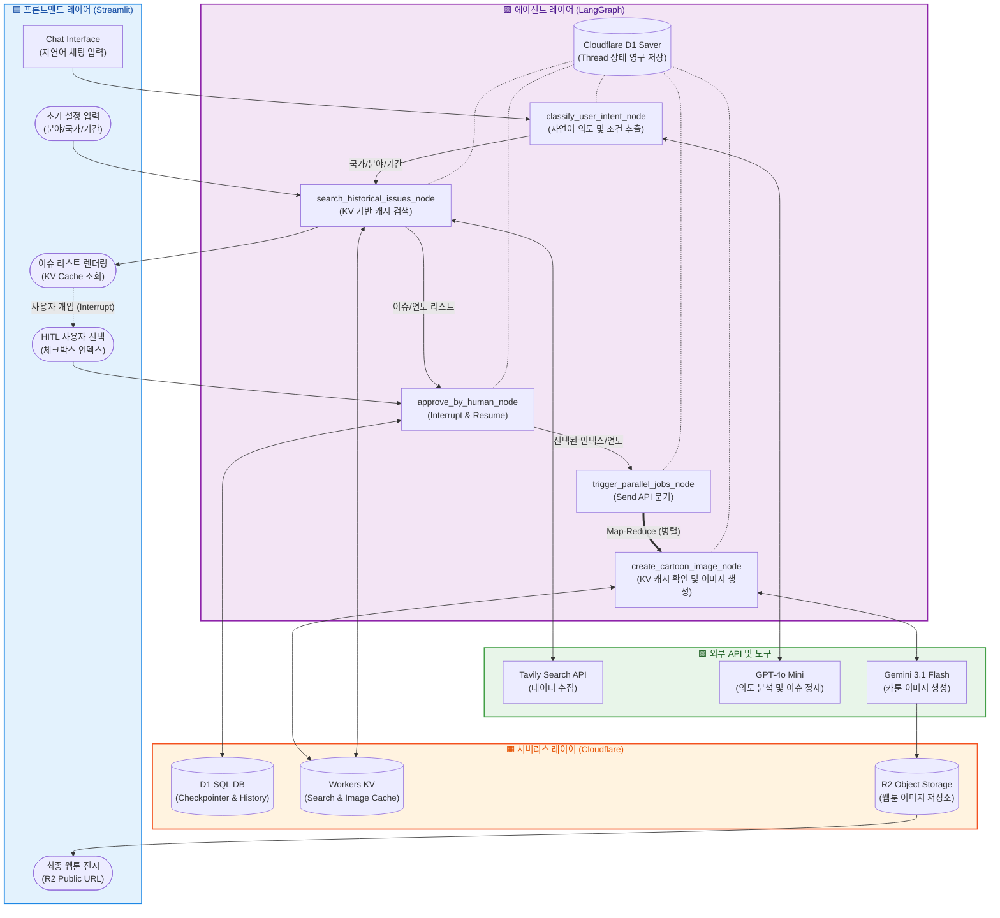

# 🌍 Geo Master Agent Plus v1.0

특정 국가의 분야별 이슈 히스토리를 분석하고, 선택한 이슈들을 한글 텍스트가 포함된 교육용 웹툰(카툰) 형태로 생성해 주는 AI 에이전트입니다.

## 1. 에이전트 개요

- **이름**: 지오 마스터 플러스 (Geo Master Plus)
- **목적**: 국가 간의 복합적인 교류/협력 히스토리를 분석하고 학습용 카툰으로 시각화하는 것을 넘어, 전 세계 지형 공간 데이터와 연동하여 글로벌 트렌드를 직관적으로 탐색할 수 있는 지능형 3D 대시보드 제공
- **핵심 기능**:
  - **스마트 국가 인식 및 동적 시점 이동**: `pycountry`와 수동 통칭 맵핑으로 국가명을 정확히 인식하고, Pydeck의 `ViewState`를 제어하여 해당 국가 상공으로 지도를 부드럽게 이동(Fly-to)
  - **인터랙티브 3D 지오 대시보드**: 대화형 메모리 내에 `{"type": "map"}` 컴포넌트를 주입하여, 검색된 국가의 이슈와 실시간 지표를 3D 기둥(`ColumnLayer`) 형태로 시각화
  - **이슈 히스토리 검색 & 도메인 맞춤형 필터링**: `Tavily`와 LLM을 결합해 경제/문화/교육/과학/방산 등 5대 도메인의 핵심 이슈 Top-N 자동 선별
  - **옴니채널 UI 양방향 동기화**: 자연어 챗봇 입력과 사이드바 위젯의 상태를 지연 업데이트(`Pending Updates`) 패턴으로 실시간 동기화하여 상태 충돌 방지
  - **Human-in-the-loop (HITL) 및 대화형 메모리**: `LangGraph`의 `interrupt/resume` 구조로 사용자가 직접 시각화할 이슈를 선택하고 검수하는 안전한 워크플로우 제어
  - **병렬 이미지 생성 및 지능형 로딩 슬라이드**: Map-Reduce 패턴으로 여러 이미지를 초고속 병렬 생성하며, 대기 시간 동안 기존 생성물을 오토 슬라이드쇼로 렌더링하여 UX 극대화
  - **완벽한 한글 타이포그래피**: `gemini-3.1-flash-image` 모델의 능력을 활용해 깨짐 없는 선명한 한글 텍스트 렌더링 지원

---

## 2. 그래프 구조

## 2. 그래프 구조

### 📄 States (상태 변수)

| 필드명             | 타입         | 설명                                                            |
| :----------------- | :----------- | :-------------------------------------------------------------- |
| `domain`           | `str`        | 유저가 선택한 분석 대상 도메인 (경제, 문화 등)                  |
| `country`          | `str`        | 유저가 입력/추출한 대상 국가                                    |
| `years`            | `int`        | 분석 대상 기간 (최근 1년 ~ 100년)                               |
| `issue_list`       | `List[str]`  | LLM이 정제하여 반환한 Top 5 이슈 리스트                         |
| `selected_indices` | `List[int]`  | 사용자가 선택한 이슈의 인덱스 번호 (HITL 입력값)                |
| `selected_years`   | `List[int]`  | 선택된 이슈 텍스트에서 추출된 개별 연도(yyyy) 리스트            |
| `final_images`     | `List[dict]` | 병렬 노드에서 생성된 이미지 데이터(URL, 캐시 적중 여부 등) 집합 |
| `messages`         | `List[Any]`  | 챗봇 UI와 연동하기 위한 대화 기록 및 에이전트 시스템 메시지     |

### 🛠️ Nodes (작업 단위)

1. **`intent_classify`**: 사용자의 자연어 입력에서 검색에 필요한 핵심 파라미터(국가, 분야, 기간)를 추출하고 정제하는 진입점 노드.
2. **`history_search`**: `tools.get_refined_issues`를 호출하여 웹 검색 및 LLM 필터링 수행 (KV 캐싱 적용).
3. **`user_approval`**: `interrupt` 함수를 통해 그래프 실행을 일시 중지하고 사용자 입력(이슈 선택) 대기 (HITL).
4. **`trigger_parallel_jobs_node`**: 사용자가 선택한 인덱스와 연도를 쌍으로 묶어 `Send` 객체를 생성하여 병렬 노드 호출 (Map-Reduce 패턴).
5. **`cartoon_generation`**: 개별 이슈에 대해 KV 캐시를 확인하고, 미적중 시 **Gemini 3.1 Flash** 모델을 통해 웹툰 이미지를 병렬로 생성.

### 🔄 Edges (흐름 제어)

- **진입 및 의도 분석**: `START` → `intent_classify`
- **조건부 검색 진입**: `intent_classify` → (국가 정보 확인 시) `history_search` / (정보 누락 시 대기) `END`
- **사용자 승인 대기**: `history_search` → `user_approval`
- **조건부 병렬 실행**: `user_approval` → (사용자 입력 수신 및 분기) `trigger_parallel_jobs_node` → `cartoon_generation` (Parallel)
- **종료**: `cartoon_generation` → `END`

---

## 3. 시스템 아키텍처

아래 다이어그램은 유저의 터미널 입력부터 최종 이미지 파일이 로컬에 저장되기까지의 전체 데이터 파이프라인과 4계층(Interface, Agent, Serverless, Tools) 아키텍처를 보여줍니다.



### 💡 시스템 아키텍처 레이어별 상세 설명

#### 🟦 **프론트엔드 레이어 (Streamlit & Chat Interface)**

- **역할**: 사용자 인터랙션 관리 및 실시간 에이전트 상태 시각화.
- **핵심 기능**:
  - **Chat UI**: `st.chat_message`와 `st.chat_input`을 통해 자연어 기반의 검색 요청을 수신하고 대화형 피드백을 제공합니다.
  - **HITL(Human-in-the-Loop)**: LangGraph의 `interrupt`에 의한 대기 상태를 체크박스 UI로 시각화하여 사용자가 최종 이슈를 선택하도록 유도합니다.
  - **멀티모달 렌더링**: 생성 완료 시 **R2 Public URL**을 호출하여 고해상도 웹툰 이미지를 브라우저에 즉시 출력합니다.
  - **인터랙티브 3D 지오 대시보드**: `pydeck`을 활용해 국가 경계 및 지표 데이터를 3D 레이어로 렌더링합니다. 사용자의 자연어 입력을 분석해 해당 국가의 위경도로 시점을 부드럽게 동적 이동(Fly-to)시킵니다.

#### 🟪 **에이전트 레이어 (LangGraph)**

- **역할**: 상태 관리(`AgentState`) 기반의 지능형 워크플로우 오케스트레이션.
- **핵심 기능**:
  - **D1 Checkpointer**: `Cloudflare D1 Saver`를 통해 에이전트의 모든 상태를 영구 저장합니다. 이를 통해 브라우저 새로고침이나 세션 종료 후에도 중단된 지점(Checkpoint)부터 즉시 재개(Resume)가 가능합니다.
  - **Map-Reduce (병렬 처리)**: 사용자가 선택한 다수의 이슈를 병렬 노드(`cartoon_generation`)로 분기 처리하여, 대기 시간을 단축하고 생성 효율을 극대화합니다.

#### 🟧 **서버리스 레이어 (Cloudflare Cloud Native)**

- **역할**: 초저지연 캐싱 및 영구 데이터 저장소 관리.
- **핵심 기능**:
  - **Workers KV**: 전 세계 엣지 노드에 검색 결과 및 생성된 이미지 경로를 캐싱합니다. 동일 조건 요청 시 외부 API 호출 없이 **0.1초 내 초저지연 응답**을 보장합니다.
  - **D1 SQL**: 서버리스 관계형 DB로 에이전트의 대화 세션, 유저 설정, 체크포인트 데이터를 안전하게 관리합니다.
  - **R2 Storage**: 생성된 이미지를 호스팅하는 S3 호환 객체 저장소로, 높은 가용성과 전용 Public URL을 통해 이미지를 제공합니다.

#### 🟩 **외부 API 및 도구 레이어**

- **역할**: 실시간 데이터 수집 및 멀티모달 콘텐츠 생성.
- **핵심 기능**:
  - **Tavily Search API**: 전 세계 웹 데이터를 실시간으로 수집하여 공신력 있고 최신성 있는 역사/경제 이슈 리스트를 확보합니다.
  - **GPT-4o Mini**: 수집된 방대한 원천 데이터를 분석하여 사용자 맞춤형 핵심 이슈를 정제하고 요약하는 추론 엔진 역할을 합니다.
  - **Gemini 3.1 Flash**: 정제된 이슈 텍스트와 컨텍스트를 기반으로 고퀄리티의 시각적 웹툰 이미지를 생성합니다.
  - **지형 공간 데이터 (Geo-Spatial Data)**: 전 세계 국가 경계(GeoJSON) 및 실시간 글로벌 지표 데이터를 호출하여 3D 대시보드의 시각적 기반을 제공합니다.

---

## 4. 서비스 실행

### Streamlit App Start

```bash
uv run streamlit run main.app
```

### Cloudflare API Token Test

```bash
curl "https://api.cloudflare.com/client/v4/accounts/b5604a8e6522c3b88f4df3ff1771e0ff/tokens/verify" \
-H "Authorization: Bearer {your_api_token_for_kv_and_d1 or your_api_token_for_r2}"
```

---

## 5. 회고 및 향후 로드맵

- **성과**: 단일 프롬프트의 한계를 벗어나 검색-검증-선택-생성의 다단계 에이전트 협업 시스템 구축
- **배운 점**: 상상 속의 아이디어를 AI 에이전트들이 협력하는 생산적인 시스템으로 구현하는 경험 확보
- **검색 캐싱**: `TavilySearch`등의 웹 검색 결과를 캐싱해서 재활용하기 위한 Cache (`kv`) 서버 연계
- **이미지 저장**: `NanoBanana`를 통해 생성된 웹툰 이미지 파일을 저장하기 위한 Storage (`r2`) 서버 연계
- **챗봇 메시징**: `Streamlit` 웹 서비스 기반으로 사용자별 대화 맥락 유지를 위한 DB (`d1`) 서버 연계
- **UI 사용성 개선**: 인터랙티브한 UI 서비스를 위해 최종적으로 `Reflex` 프레임워크 기반의 풀스택 앱으로 확장 예정

---

## 🛡️ 제약 조건 및 예외 처리

프로젝트의 안정성과 사용자 경험을 개선하기 위해 다음과 같은 제약 사항과 방어 로직이 구현되었습니다.

### 1. 사용자 입력 검증 (Input Validation)

- **1부터 시작하는 번호 체계**: 사용자의 편의를 위해 내부 인덱스(0~9) 대신 터미널 UI 상에서 **1~10** 사이의 번호를 입력받도록 개선되었습니다.
- **범위 초과 방지**: `human_approval_node`에서 사용자가 1~10 범위를 벗어난 값을 입력할 경우, `IndexError`를 발생시키지 않고 올바른 값을 입력할 때까지 재안내 메시지를 출력합니다.
- **데이터 형식 검증**: 숫자가 아닌 문자나 잘못된 구분자 입력 시 예외 처리를 통해 에이전트가 중단되지 않도록 보호합니다.

### 2. 콘텐츠 안전 정책 대응 (OpenAI Safety System)

- **이미지 생성 차단 처리**: 지정학적 이슈 중 폭력성이나 민감한 정치적 사안으로 인해 OpenAI의 안전 가이드라인(`content_policy_violation`)에 걸릴 경우, 에러로 종료되지 않습니다.
- **텍스트 대체 로직 (Fallback)**: 이미지가 차단된 경우, 해당 이슈의 핵심 내용을 담은 **텍스트 요약본**을 결과값으로 반환하여 전체 워크플로우의 연속성을 보장합니다.

### 3. 병렬 실행 및 리소스 관리 (Send API)

- **Send API 활용**: 사용자가 선택한 여러 이슈에 대해 이미지를 생성할 때, 순차 실행이 아닌 **병렬(Parallel) 실행**을 통해 응답 대기 시간을 획기적으로 줄였습니다.
- **결과 확인**: 생성된 이미지는 Base64 데이터로 수집되며, 로컬 환경 실행 시 `image_{hash}.png` 형태로 자동 저장되어 실시간으로 결과물을 확인할 수 있습니다.

### 4. 메모리 및 상태 관리 (Cloudflare D1)

- **Checkpointer 연동**: `MemorySaver`를 사용하여 LangGraph 워크플로우의 상태를 인메모리에 저장하며, Human-in-the-loop(HITL) 단계에서 워크플로우의 안전한 일시 정지(Interrupt) 및 사용자 개입 후 재개(Resume)를 완벽하게 제어합니다.
- 향후 Streamlit 웹 서비스 연동 시, 사용자별 대화 맥락 유지를 위한 영구 DB Checkpointer로 확장 예정입니다.

### 5. 라이브러리 최신화 및 데이터 규격 대응

- **TavilySearch 전환**: `langchain-community`의 Deprecation 경고를 해결하기 위해 `langchain-tavily` 패키지의 `TavilySearch`로 교체되었습니다.
- **데이터 파싱 최적화**: 최신 도구는 검색 결과를 구조화된 리스트가 아닌 정제된 단일 문자열로 반환할 수 있으므로, `TypeError` 방지를 위해 입력 데이터 타입을 동적으로 판별하여 처리하도록 로직을 개선했습니다.

### 6. 출력 데이터 노이즈 제거 (Parsing Optimization)

- **현상**: LLM 응답 시 포함되는 서론/설명 문구(예: "다음은 ~입니다")가 이슈 리스트에 혼입되어 사용자 선택 시 혼선 발생.
- **해결**:
  - **Negative Prompting**: 프롬프트 내에 서론/결론 금지 규칙(Output Restriction) 명시.
  - **Regex-like Filtering**: 파이썬 코드 단에서 `isdigit()` 검사를 통해 숫자로 시작하지 않는 불필요한 텍스트 라인을 원천 차단.

### 7. 이미지 생성 엔진 교체 (GPT -> Nano Banana 2)

- **도입 배경**: 기존 DALL-E 3 모델의 한글 폰트 깨짐 현상(Rendering Issue)을 해결하기 위해 최신 한국어 지원 모델 도입.
- **기술 스택**: **Gemini 3 Flash Image (Nano Banana 2)** 모델 적용.
- **주요 장점**:
  - **한글 텍스트 지원**: 이미지 내 한글 텍스트를 깨짐 없이 정확하게 렌더링.
  - **고화질 생성**: 교육용 콘텐츠에 적합한 깔끔하고 세련된 화풍 제공.
  - **속도 최적화**: Flash 기반 모델의 빠른 생성 속도로 사용자 대기 시간 단축.

### 8. API 캐싱 및 비용 최적화 (Cloudflare KV)

본 프로젝트는 에이전트의 응답 속도를 극대화하고 외부 API(Tavily, Gemini) 호출 비용을 절감하기 위해 **이중 레이어 서버리스 캐싱 전략**을 도입했습니다.

#### 8.1. 실시간 검색 결과 캐싱

- **현상**: 동일 조건(국가, 기간, 분야) 반복 검색 시 Tavily API 크레딧이 소모되고, 매번 3~5초의 네트워크 대기 시간이 발생함.
- **해결**: 초저지연 글로벌 엣지 저장소인 **Cloudflare KV**를 활용하여 검색 결과를 캐싱함.
- **작동 방식**:
  - 사용자 입력값(`{domain}_{country}_{years}`)을 조합하여 고유한 `search_cache_key` 생성.
  - **Cache Hit**: 전 세계 엣지 노드에 복제된 KV에서 0.1초 이내에 검색 결과를 즉시 반환.
  - **Cache Miss**: 최초 검색 시에만 Tavily API를 호출하고, 결과(JSON)를 KV에 저장.
- **효과**: 중복 검색 시 응답 속도 95% 이상 단축 및 API 과금 원천 차단.

#### 8.2. AI 웹툰 이미지 캐싱

- **현상**: 동일한 역사적 이슈에 대해 웹툰 생성을 반복 요청할 경우, Gemini API 호출 비용이 발생하며 이미지 생성 시간(20~30초)이 매번 소요됨.
- **해결**: 초저지연 글로벌 키-값 저장소인 **Cloudflare KV**를 활용한 이미지 경로 캐싱 도입.
- **작동 방식**:
  - 선택된 이슈의 **개별 연도(yyyy)**와 핵심 키워드를 조합하여 고정 해시(`hashlib.md5`) 생성.
  - **Key Format**: `{domain}_{country}_{year}_{text[:20]}`
  - **Cache Hit**: Gemini 호출 단계를 건너뛰고 R2 스토리지에 저장된 이미지 URL을 즉시 반환하여 **0.5초 내 렌더링**.
- **효과**: GPU 연산 비용 절감 및 사용자 경험(UX) 혁신.

#### 8.3. 캐시 관리 및 데이터 무결성

- **서버리스 영구 캐시**: 로컬 파일(`sqlite3`) 방식과 달리 Cloudflare 엣지 네트워크에 저장되므로, 서버(WSL2/Docker 등)를 재시작하거나 배포 환경이 바뀌어도 캐시가 유실되지 않음.
- **해시 일관성 보장**: 파이썬 내장 `hash()` 함수는 보안상 프로세스 재시작 시 시드(Seed)가 변하여 키값이 달라지는 문제가 있음. 이를 해결하기 위해 `hashlib` 기반의 고정 해시 알고리즘을 채택하여 데이터 일관성을 보장함.
- **데이터 갱신**: 최신 실시간 정보를 강제로 불러오고 싶다면 Cloudflare 대시보드(D1/KV)에서 해당 레코드를 삭제하거나, 새로운 `thread_id`로 세션을 시작함.

### 9. 다국어 및 국가명 입력 예외 처리 (Global Country Mapping)

- **현상 (제약 조건)**: 사용자가 국가명을 한글(미국), 영문(United States), 약어(US, UK), ISO 코드(USA, KR) 등 일관성 없는 포맷으로 입력하거나 오타를 발생시킬 경우, 검색 엔진과 LLM의 인식률이 떨어져 엉뚱한 결과가 나오거나 에러가 발생할 위험이 있음.
- **해결 및 예외 처리**:
  - `pycountry` 라이브러리와 사용자 지정 통칭(Alias) 데이터를 결합하여 **다국어/코드 통합 맵핑 딕셔너리**를 선제적으로 구축.
  - 사용자의 모든 입력값을 대소문자 구분 없이 소문자로 변환(`.lower()`)하여 맵핑 딕셔너리와 대조하는 검증 로직 적용.
  - **데이터 표준화**: 유효한 입력으로 판별되면, 검색 정확도를 극대화하기 위해 에이전트 내부 상태(`State`)에는 반드시 **공식 영문 명칭(예: `Korea, Republic of`)**으로 변환하여 저장.
  - **안전한 루프(Fallback)**: 딕셔너리에 존재하지 않는 완전히 잘못된 값이나 오타가 입력될 경우, 에이전트가 다운(Crash)되지 않고 `while True` 루프를 통해 경고 메시지("❌ 등록되지 않거나 잘못된 국가명입니다")를 출력한 뒤 재입력을 유도하도록 견고하게 설계됨.

### 10. 지능형 의도 분석 및 LLM 입력 포맷 최적화 (Intent Classification)

- **현상**: 사용자의 자연어 입력에서 국가/분야/기간을 직접 추출하기 위해 `classify_user_intent_node`를 도입했으나, LangChain의 메시지 객체(Tuple 형태)가 OpenAI API로 그대로 전달되어 `400 Bad Request (Invalid type)` 에러가 발생함.
- **해결 및 방어 로직**:
  - 메시지 리스트에서 마지막 사용자의 입력을 추출할 때, 데이터 타입(Tuple vs Object)을 동적으로 판별하여 순수 문자열(String)로 정제한 뒤 LLM 프롬프트에 주입하도록 수정.
  - 국가 정보가 누락된 경우 에이전트가 에러를 발생시키는 대신, 사용자에게 재입력을 요청하는 유연한 대화형(Fallback) 메시지를 반환하도록 처리.

### 11. API 과부하(503 에러) 대응 및 자동 재시도 (Exponential Backoff)

- **현상**: Gemini 3.1 Flash 모델의 높은 트래픽으로 인해 간헐적으로 `503 UNAVAILABLE` 또는 고부하 에러가 발생하며 에이전트가 중단되는 현상 발생.
- **해결**: `tenacity` 라이브러리를 활용한 **지수 백오프(Exponential Backoff)** 재시도 로직 적용.
  - 총 4회 재시도하며, 대기 시간을 점진적으로 증가(3초 ➔ 6초 ➔ 12초)시켜 서버 부담을 최소화함.
  - **Graceful Degradation**: 모든 재시도에 실패하더라도 앱이 다운(Crash)되지 않도록 `retry_error_callback`을 구현하여, UI 상에 친절한 노란색 경고(Warning) 뱃지와 지연 안내 메시지를 출력하도록 안정성 확보.

### 12. 상태 기반 UI 렌더링 및 화면 증발(Vanishing UI) 방지

- **현상**: 비동기 이미지 생성 완료 후 `st.rerun()` 호출 시 화면의 이미지가 사라지거나, 처리 중 사용자가 다른 버튼을 연타하여 상태가 엉키고 간헐적인 `KeyError`가 발생하는 문제.
- **해결 및 UI/UX 개선**:
  - **단방향 제어(State Lock)**: `is_processing` 세션 상태를 도입하여 작업 진행 중에는 모든 사이드바 입력창과 채팅창, 버튼들을 비활성화(Disabled)하여 중복 실행 원천 차단.
  - **안전한 데이터 추출**: 딕셔너리 데이터 접근 시 `[]` 대신 `.get()` 메서드를 적극 활용하여 데이터 누락 시에도 안전하게 우회하도록 방어적 코딩 적용.
  - **대화 기록 영구 보존**: 생성된 이미지 경로와 캐시 여부를 `st.session_state.messages`에 딕셔너리 형태로 저장하여, 화면 갱신(`st.rerun()`) 이후에도 채팅창 맨 아래에 이미지가 안정적으로 렌더링되도록 구조화.
  - **동적 UI 숨김**: 웹툰 생성 버튼 클릭 즉시 `waiting_for_user = False`로 상태를 변경하여, 완료된 메뉴판(체크박스)을 화면에서 즉시 제거해 레이아웃을 깔끔하게 유지.

### 13. LangGraph 세션(Thread) 충돌 방지 및 메모리 초기화

- **현상**: 이전 검색 결과가 LangGraph의 Thread(메모리)에 남아있는 상태에서 새로운 이슈 검색을 시도할 경우, 체크포인터의 상태가 충돌하여 화면에 아무런 반응이 없는 먹통 현상 발생.
- **해결**:
  - 사이드바의 '이슈 검색 시작' 버튼을 클릭하거나, 채팅창을 통해 신규 검색을 시작할 때마다 `st.session_state.thread_id`를 새로운 UUID(`uuid.uuid4()`)로 즉시 갱신하도록 로직 수정.
- **효과**: 매 검색마다 에이전트가 이전 맥락의 간섭 없이 완전히 깨끗한 상태(Clean State)에서 워크플로우를 시작하도록 보장하여 무반응 버그 완벽 해결.

### 14. 자연어 입력 기반 UI 상태 동기화 (Pending Updates 패턴)

- **현상**: 사용자가 채팅창에 자연어(예: "미국의 30년 방산 이슈")로 검색 조건을 입력했을 때, 에이전트가 의도를 파악하더라도 좌측 사이드바의 위젯 값들이 자동으로 변경되지 않아 UI와 내부 상태 간의 불일치가 발생함.
- **제약 사항**: Streamlit의 렌더링 특성상 하단 로직에서 상단에 이미 렌더링된 위젯의 `key` 값을 직접 수정하려고 하면 `StreamlitAPIException` (상태 충돌) 에러가 발생함.
- **해결 및 최적화**:
  - **상태 분리(Decoupling) 및 지연 업데이트 적용**: 에이전트의 `intent_classify` 노드에서 추출된 값(국가, 분야, 기간)을 위젯에 즉시 덮어쓰지 않고, `st.session_state.pending_updates`라는 임시 딕셔너리에 저장함.
  - 이후 `st.rerun()`을 호출하여 앱이 최상단부터 다시 렌더링될 때, 이 임시 버퍼의 값을 확인하여 사이드바 위젯의 기본 상태값으로 일괄 주입한 뒤 버퍼를 비우는 방식으로 에러를 완벽히 우회함.
- **효과**: 상태 충돌 에러 없이 채팅창의 자연어 입력 결과가 사이드바 UI에 실시간으로 반영되는 완벽한 양방향 동기화(Two-way Binding) 구현.

### 15. 챗봇 자연어 입력 예외 처리 및 에러 규격화 (Guardrails)

- **현상**: 사이드바는 코드 단에서 하드코딩된 검증이 가능하지만, 채팅창의 경우 사용자가 형태를 갖추지 않은 문장(예: "아무거나 알려줘", "안녕")을 입력할 수 있음. 이 경우 LLM이 필수 파라미터(국가명 등)를 추출하지 못해 파이프라인이 중단되거나, LLM이 임의로 생성한 영문/비규격 에러 메시지를 반환하여 전체적인 에러 UX가 파편화됨.
- **해결 및 방어 로직**:
  - **Intent 검증 가드레일**: `intent_classify` 단계에서 반환된 `country` 값이 비어있거나 `unknown`, `null` 등 유효하지 않은 데이터로 판별될 경우, 후속 노드(`history_search`)로 진입하지 않고 에이전트 실행을 즉시 중단함.
  - **메시지 통일화**: LLM의 자유로운 에러 응답을 차단하고, 사이드바에서 사용하는 에러 메시지와 동일한 규격("❌ 등록되지 않거나 잘못된 국가명입니다. 정확한 국가명이나 코드를 입력해주세요.")으로 강제 덮어씌워 챗봇 UI에 출력함.
- **효과**: 입력 채널(사이드바/채팅창)에 관계없이 일관된 에러 처리 경험을 제공하며, 잘못된 데이터 입력으로 인한 불필요한 검색 API 및 LLM 호출 비용 낭비를 원천 차단함.

### 16. 로딩 최적화를 위한 지능형 슬라이드쇼 (Smart Loading Slide)

- **현상**: Gemini 3.1 Flash 모델을 통한 병렬 이미지 생성 시, 네트워크 및 연산량으로 인해 발생할 수 있는 약 20~30초의 로딩 시간 동안 사용자가 정적인 스피너(Spinner)만 보게 되어 이탈률이 높아질 우려가 있음.
- **제약 사항**: Streamlit의 백엔드(Python)가 이미지 생성 함수를 실행하는 동안에는 'Blocking' 상태가 되어 일반적인 위젯이나 UI 업데이트가 중단됨.
- **해결 및 기술적 구현**:
  - **Base64 이미지 인코딩**: 로컬에 저장된 기존 웹툰 이미지들을 브라우저가 직접 해석할 수 있도록 Base64 포맷으로 동적 변환하는 `get_image_base64` 함수 구현.
  - **HTML/JS 인젝션**: 파이썬 엔진이 멈춰있어도 브라우저 자체적으로 작동할 수 있도록 `streamlit.components.v1`을 활용해 순수 JavaScript 기반의 **오토 슬라이드쇼** 코드를 주입함.
  - **UX 디테일 개선**: 3초 간격의 Fade-in/out 애니메이션 효과와 함께 하단 타이틀이 잘리지 않도록 `iframe` 컨테이너의 높이(`height=550`)와 텍스트 줄 간격(`line-height: 1.5`)을 정밀하게 조정함.
- **효과**: 새로운 결과물을 기다리는 동안 기존에 생성된 작품들을 감상하게 함으로써 로딩 체감 시간을 획기적으로 단축하고, 서비스의 연속성을 유지함.

### 17. 세션 키 참조 무결성 확보 (KeyError 방어)

- **현상**: 사이드바 기반 검색(직접 입력)과 챗봇 기반 검색(자연어 추출)의 데이터 경로가 다름에 따라, 특정 UI 컴포넌트에서 공통으로 참조하는 세션 키(`country_input`)가 생성되지 않아 앱이 크래시되는 `KeyError` 발생.
- **해결**:
  - **Global Initialization**: 앱 진입 시 모든 필수 세션 키에 대해 기본값을 할당하는 전역 초기화 로직 강화.
  - **Safe Retrieval**: 세션 상태에 직접 접근(`[]`)하는 대신 `.get()` 메서드를 사용하여 키 누락 시에도 앱이 중단되지 않고 기본값을 출력하도록 방어적 코딩 적용.
- **효과**: 사용자 입력 채널에 관계없이 런타임 에러 없는 견고한 서비스 상태 유지.

### 18. 지형 공간 기반 에이전트 활동 3D 시각화 대시보드 (Interactive 3D Geo-Dashboard)

- **배경**: 텍스트 입출력 중심의 챗봇 UX를 넘어, 사용자들이 어느 국가의 이슈에 관심을 가지고(검색량) 실제 콘텐츠화(웹툰 생성량)를 얼마나 진행했는지 글로벌 트렌드를 한눈에 파악할 수 있는 지능형 대시보드가 필요함.
- **해결 및 기술적 구현**:
  - **Pydeck 다중 레이어(Multi-layer) 데이터 매핑**: WebGL 기반의 고성능 시각화 라이브러리인 `pydeck`을 도입. `GeoJsonLayer`를 활용해 전 세계 국가 경계를 밑바탕으로 렌더링하고, 그 위에 `ColumnLayer`를 얹어 **국가별 이슈 검색량과 웹툰 생성량 데이터를 3D 기둥으로 시각화**함. 지표의 종류(검색 vs 생성)에 따라 기둥의 색상을 다르게 적용하고, 트래픽 볼륨에 비례하여 높이를 동적으로 렌더링함.
  - **API 캐싱을 통한 성능 최적화**: 무거운 세계 지도 GeoJSON 파일 파싱으로 인해 앱 갱신(Rerun) 시 발생하는 렌더링 지연(Bottleneck)을 방지하기 위해, `@st.cache_data(ttl=3600)`를 적용하여 데이터 로딩을 메모리에 캐싱하고 프론트엔드 반응성을 대폭 개선함.
  - **컴포넌트 렌더링 순서 제어**: Streamlit의 Top-down 렌더링 특성상 지도가 앱 최상단으로 밀려나는 레이아웃 문제를 해결하기 위해, 지도 컴포넌트를 채팅 메시지 객체(`{"type": "map"}`)로 캡슐화함. 이를 통해 대화 기록 출력 루프 내에서 원하는 위치(안내 문구 직후)에 지도가 자연스럽게 안착하도록 렌더링 순서를 완벽히 통제함.
- **효과**: 단순한 텍스트 에이전트를 넘어, 전 세계 지리적 맥락 위에서 유저들의 관심도와 에이전트의 활동 지표를 실시간으로 모니터링할 수 있는 프로덕션 레벨의 데이터 대시보드를 구축함.

### 19. 대화형 지도 동적 시점 이동 (Dynamic ViewState & Fly-to)

- **배경**: 사용자가 챗봇이나 사이드바를 통해 특정 국가의 이슈를 검색했을 때, 지도의 시점이 기존 위치에 고정되어 있어 에이전트가 입력을 정확히 인지했는지에 대한 시각적인 피드백이 부족함.
- **해결 및 기술적 구현**:
  - **위경도 메타데이터 통합**: 전 세계 240여 개국의 국가 코드(Alpha-2)를 기준으로 위도(lat), 경도(lon), 적정 줌 레벨(zoom)이 포함된 `GEO_METADATA`를 구축하고 기존 `pycountry` 매핑 로직에 결합함.
  - **상태 기반 ViewState 제어**: Pydeck의 `initial_view_state`를 하드코딩하지 않고 `st.session_state.map_view_state` 변수와 바인딩함. 유저 입력 시 추출된 국가의 좌표로 세션 상태를 업데이트하여, 화면 갱신 시 지도가 해당 국가 상공으로 부드럽게 이동(Fly-to)하도록 구현.
- **효과**: 에이전트가 사용자의 자연어 의도를 정확히 파악했다는 사실을 시각적(지도 줌인)으로 즉시 증명하며, 서비스의 인터랙션 퀄리티를 극대화함.

### 20. 통칭/약어 검색 시 데이터 구조 무결성 확보 (TypeError 방어)

- **현상**: '미국', 'UK', 'USA' 등 수동 보완된 통칭/약어(`GEO_ALIASES`)로 검색할 경우, 딕셔너리 객체가 아닌 단순 문자열(String)이 반환되어 Pydeck 좌표 추출 과정에서 `TypeError: string indices must be integers`가 발생함.
- **해결 및 방어 로직**:
  - **객체 참조 매핑**: 수동 보완 단어 목록을 통합 맵에 병합할 때, 단순 문자열을 할당하는 대신 기존에 생성된 **국가 메타데이터 딕셔너리 객체**를 찾아 그대로 참조(Reference)하도록 로직을 수정함.
  - **Fallback 딕셔너리 주입**: 맵에서 일치하는 객체를 찾지 못하는 예외 케이스를 대비하여, 구조가 깨지지 않도록 기본값(Default)을 가진 안전한 형태의 딕셔너리를 주입함.
- **효과**: 공식 명칭, 약어, 한글, 영문 등 어떤 형태의 국가명이 입력되더라도 백엔드와 프론트엔드 간에 항상 동일한 규격의 메타데이터(위경도, 줌 레벨 등)가 안전하게 전달되도록 보장하여 런타임 에러를 원천 차단함.
