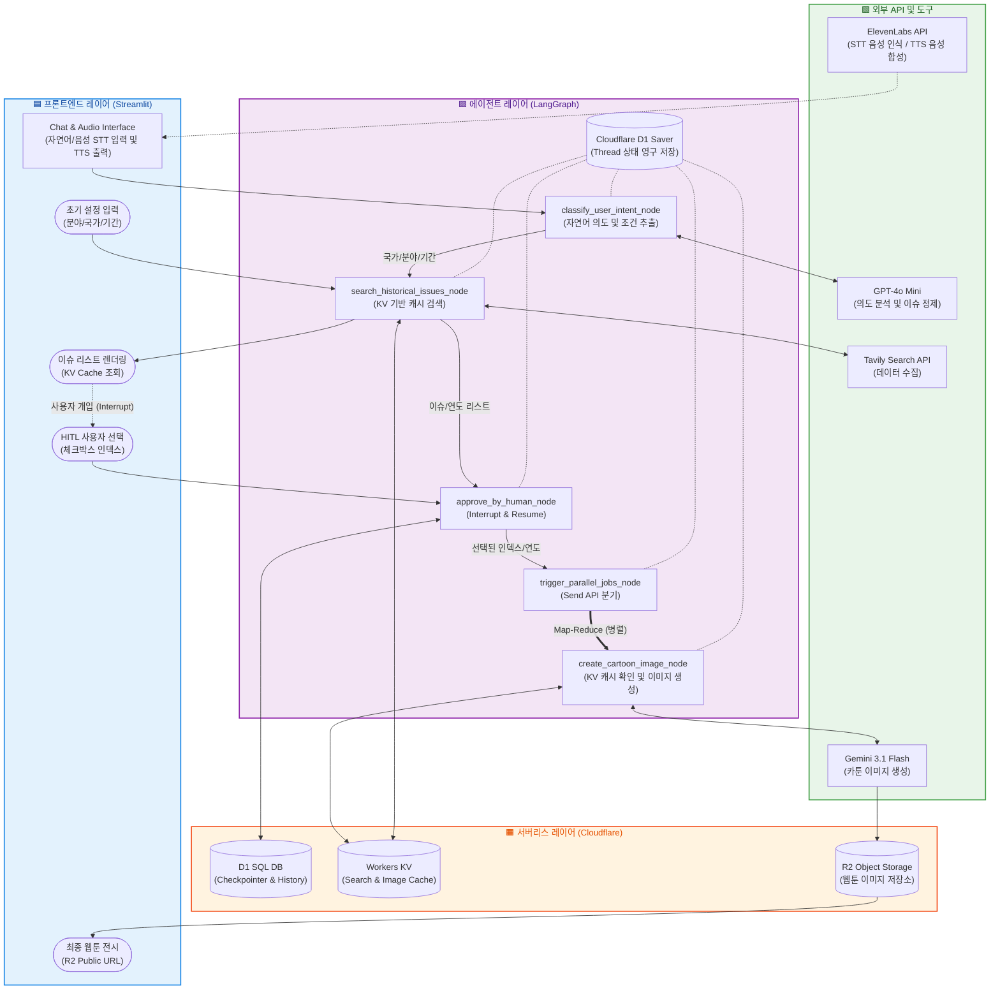

# 🌍 Geo Master Agent Plus v1.0

특정 국가의 분야별 이슈 히스토리를 분석하고, 선택한 이슈들을 한글 텍스트가 포함된 교육용 웹툰(카툰) 형태로 생성해 주는 AI 에이전트입니다.

## 1. 에이전트 개요

- **이름**: 지오 마스터 플러스 (Geo Master Plus)
- **목적**: 국가 간의 복합적인 교류/협력 히스토리를 분석하고 학습용 카툰으로 시각화하는 것을 넘어, 전 세계 지형 공간 데이터와 연동하여 글로벌 트렌드를 직관적으로 탐색할 수 있는 지능형 3D 대시보드 제공
- **핵심 기능**:
  - **스마트 국가 인식 및 동적 시점 이동**: `pycountry`와 수동 통칭 맵핑으로 국가명을 정확히 인식하고, Pydeck의 `ViewState`를 제어하여 해당 국가 상공으로 지도를 부드럽게 이동(Fly-to)
  - **인터랙티브 3D 지오 대시보드**: 대화형 메모리 내에 `{"type": "map"}` 컴포넌트를 주입하여, 검색된 국가의 이슈와 실시간 지표를 3D 기둥(`ColumnLayer`) 형태로 시각화
  - **이슈 히스토리 검색 & 도메인 맞춤형 필터링**: `Tavily`와 LLM을 결합해 경제/문화/교육/과학/방산 등 5대 도메인의 핵심 이슈 Top-N 자동 선별
  - **옴니채널 UI 양방향 동기화**: 자연어 챗봇 입력과 사이드바 위젯의 상태를 지연 업데이트(`Pending Updates`) 패턴으로 실시간 동기화하여 상태 충돌 방지
  - **멀티모달 음성 인터랙션 (STT & TTS)**: `ElevenLabs` API를 연동하여 사용자의 음성을 인식해 이슈를 검색(STT)하고, 생성된 웹툰의 설명을 고품질 AI 보이스로 즉시 읽어주는(TTS) 양방향 오디오 인터페이스 제공
  - **Human-in-the-loop (HITL) 및 대화형 메모리**: `LangGraph`의 `interrupt/resume` 구조로 사용자가 직접 시각화할 이슈를 선택하고 검수하는 안전한 워크플로우 제어
  - **병렬 이미지 생성 및 지능형 로딩 슬라이드**: Map-Reduce 패턴으로 여러 이미지를 초고속 병렬 생성하며, 대기 시간 동안 기존 생성물을 오토 슬라이드쇼로 렌더링하여 UX 극대화
  - **완벽한 한글 타이포그래피**: `gemini-3.1-flash-image` 모델의 능력을 활용해 깨짐 없는 선명한 한글 텍스트 렌더링 지원

---

## 2. 그래프 구조

### 📄 States (상태 변수)

| 필드명             | 타입         | 설명                                                            |
| :----------------- | :----------- | :-------------------------------------------------------------- |
| `domain`           | `str`        | 유저가 선택한 분석 대상 도메인 (경제, 문화 등)                  |
| `country`          | `str`        | 유저가 입력/추출한 대상 국가                                    |
| `years`            | `int`        | 분석 대상 기간 (최근 1년 ~ 100년)                               |
| `issue_list`       | `List[str]`  | LLM이 정제하여 반환한 Top 5 이슈 리스트                         |
| `selected_indices` | `List[int]`  | 사용자가 선택한 이슈의 인덱스 번호 (HITL 입력값)                |
| `selected_years`   | `List[int]`  | 선택된 이슈 텍스트에서 추출된 개별 연도(yyyy) 리스트            |
| `final_images`     | `List[dict]` | 병렬 노드에서 생성된 이미지 데이터(URL, 캐시 적중 여부 등) 집합 |
| `messages`         | `List[Any]`  | 챗봇 UI와 연동하기 위한 대화 기록 및 에이전트 시스템 메시지     |

### 🛠️ Nodes (작업 단위)

1. **`intent_classify`**: 사용자의 자연어 입력에서 검색에 필요한 핵심 파라미터(국가, 분야, 기간)를 추출하고 정제하는 진입점 노드.
2. **`history_search`**: `tools.get_refined_issues`를 호출하여 웹 검색 및 LLM 필터링 수행 (KV 캐싱 적용).
3. **`user_approval`**: `interrupt` 함수를 통해 그래프 실행을 일시 중지하고 사용자 입력(이슈 선택) 대기 (HITL).
4. **`trigger_parallel_jobs_node`**: 사용자가 선택한 인덱스와 연도를 쌍으로 묶어 `Send` 객체를 생성하여 병렬 노드 호출 (Map-Reduce 패턴).
5. **`cartoon_generation`**: 개별 이슈에 대해 KV 캐시를 확인하고, 미적중 시 **Gemini 3.1 Flash** 모델을 통해 웹툰 이미지를 병렬로 생성.

### 🔄 Edges (흐름 제어)

- **진입 및 의도 분석**: `START` → `intent_classify`
- **조건부 검색 진입**: `intent_classify` → (국가 정보 확인 시) `history_search` / (정보 누락 시 대기) `END`
- **사용자 승인 대기**: `history_search` → `user_approval`
- **조건부 병렬 실행**: `user_approval` → (사용자 입력 수신 및 분기) `trigger_parallel_jobs_node` → `cartoon_generation` (Parallel)
- **종료**: `cartoon_generation` → `END`

---

## 3. 시스템 아키텍처

아래 다이어그램은 유저의 터미널 입력부터 최종 이미지 파일이 로컬에 저장되기까지의 전체 데이터 파이프라인과 4계층(Interface, Agent, Serverless, Tools) 아키텍처를 보여줍니다.


```mermaid
flowchart TB
    %% 스타일 정의
    classDef interface fill:#e3f2fd,stroke:#1e88e5,stroke-width:2px,color:#0d47a1
    classDef agent fill:#f3e5f5,stroke:#8e24aa,stroke-width:2px,color:#4a148c
    classDef serverless fill:#fff3e0,stroke:#f4511e,stroke-width:2px,color:#e65100
    classDef tools fill:#e8f5e9,stroke:#43a047,stroke-width:2px,color:#1b5e20

    subgraph Interface ["🟦 프론트엔드 레이어 (Streamlit)"]
        direction TB
        Chat["Chat & Audio Interface<br/>(자연어/음성 STT 입력 및 TTS 출력)"]
        UI1(["초기 설정 입력<br/>(분야/국가/기간)"])
        UI2(["이슈 리스트 렌더링<br/>(KV Cache 조회)"])
        UI3(["HITL 사용자 선택<br/>(체크박스 인덱스)"])
        UI4(["최종 웹툰 전시<br/>(R2 Public URL)"])
    end

    subgraph Agent ["🟪 에이전트 레이어 (LangGraph)"]
        direction TB
        Saver[("Cloudflare D1 Saver<br/>(Thread 상태 영구 저장)")]
        N0["classify_user_intent_node<br/>(자연어 의도 및 조건 추출)"]
        N1["search_historical_issues_node<br/>(KV 기반 캐시 검색)"]
        N2["approve_by_human_node<br/>(Interrupt & Resume)"]
        N3["trigger_parallel_jobs_node<br/>(Send API 분기)"]
        N4["create_cartoon_image_node<br/>(KV 캐시 확인 및 이미지 생성)"]

        Saver -.- N0 & N1 & N2 & N3 & N4
        N0 -->|국가/분야/기간| N1
        N1 -->|이슈/연도 리스트| N2
        N2 -->|선택된 인덱스/연도| N3
        N3 == "Map-Reduce (병렬)" ==> N4
    end

    subgraph Serverless ["🟧 서버리스 레이어 (Cloudflare)"]
        direction TB
        D1[("D1 SQL DB<br/>(Checkpointer & History)")]
        KV[("Workers KV<br/>(Search & Image Cache)")]
        R2[("R2 Object Storage<br/>(웹툰 이미지 저장소)")]
    end

    subgraph Tools ["🟩 외부 API 및 도구"]
        direction TB
        Tavily["Tavily Search API<br/>(데이터 수집)"]
        GPT["GPT-4o Mini<br/>(의도 분석 및 이슈 정제)"]
        Gemini["Gemini 3.1 Flash<br/>(카툰 이미지 생성)"]
        ElevenLabs["ElevenLabs API<br/>(STT 음성 인식 / TTS 음성 합성)"]
    end

    %% 상호작용 흐름
    Chat --> N0
    N0 <--> GPT
    N1 <--> KV
    N1 <--> Tavily
    N1 --> UI2

    UI1 --> N1
    UI2 -. "사용자 개입 (Interrupt)" .-> UI3
    UI3 --> N2
    N2 <--> D1

    N4 <--> KV
    N4 <--> Gemini
    Gemini --> R2
    R2 --> UI4

    ElevenLabs -.-> Chat

    %% 클래스 적용
    class Interface interface
    class Agent agent
    class Serverless serverless
    class Tools tools
```

### 💡 시스템 아키텍처 레이어별 상세 설명

#### 🟦 **프론트엔드 레이어 (Streamlit & Chat Interface)**

- **역할**: 사용자 인터랙션 관리 및 실시간 에이전트 상태 시각화.
- **핵심 기능**:
  - **Chat & Voice UI**: `st.chat_input`과 `st.audio_input`을 통해 텍스트와 음성(STT) 양방향 검색 요청을 수신하고 대화형 피드백을 제공합니다.
  - **HITL(Human-in-the-Loop)**: LangGraph의 `interrupt`에 의한 대기 상태를 체크박스 UI로 시각화하여 사용자가 최종 이슈를 선택하도록 유도합니다.
  - **멀티모달 렌더링**: 생성 완료 시 고해상도 웹툰 이미지를 출력함과 동시에, ElevenLabs TTS 오디오를 `autoplay`로 실행하여 입체적인 시청각 경험을 제공합니다.
  - **인터랙티브 3D 지오 대시보드**: `pydeck`을 활용해 국가 경계 및 지표 데이터를 3D 레이어로 렌더링합니다. 사용자의 자연어 입력을 분석해 해당 국가의 위경도로 시점을 부드럽게 동적 이동(Fly-to)시킵니다.

#### 🟪 **에이전트 레이어 (LangGraph)**

- **역할**: 상태 관리(`AgentState`) 기반의 지능형 워크플로우 오케스트레이션.
- **핵심 기능**:
  - **D1 Checkpointer**: `Cloudflare D1 Saver`를 통해 에이전트의 모든 상태를 영구 저장합니다. 이를 통해 브라우저 새로고침이나 세션 종료 후에도 중단된 지점(Checkpoint)부터 즉시 재개(Resume)가 가능합니다.
  - **Map-Reduce (병렬 처리)**: 사용자가 선택한 다수의 이슈를 병렬 노드(`cartoon_generation`)로 분기 처리하여, 대기 시간을 단축하고 생성 효율을 극대화합니다.

#### 🟧 **서버리스 레이어 (Cloudflare Cloud Native)**

- **역할**: 초저지연 캐싱 및 영구 데이터 저장소 관리.
- **핵심 기능**:
  - **Workers KV**: 전 세계 엣지 노드에 검색 결과 및 생성된 이미지 경로를 캐싱합니다. 동일 조건 요청 시 외부 API 호출 없이 **0.1초 내 초저지연 응답**을 보장합니다.
  - **D1 SQL**: 서버리스 관계형 DB로 에이전트의 대화 세션, 유저 설정, 체크포인트 데이터를 안전하게 관리합니다.
  - **R2 Storage**: 생성된 이미지를 호스팅하는 S3 호환 객체 저장소로, 높은 가용성과 전용 Public URL을 통해 이미지를 제공합니다.

#### 🟩 **외부 API 및 도구 레이어**

- **역할**: 실시간 데이터 수집 및 멀티모달 콘텐츠 생성.
- **핵심 기능**:
  - **Tavily Search API**: 전 세계 웹 데이터를 실시간으로 수집하여 공신력 있고 최신성 있는 역사/경제 이슈 리스트를 확보합니다.
  - **GPT-5o Mini**: 수집된 방대한 원천 데이터를 분석하여 사용자 맞춤형 핵심 이슈를 정제하고 요약하는 추론 엔진 역할을 합니다.
  - **Gemini 3.1 Flash Image**: 정제된 이슈 텍스트와 컨텍스트를 기반으로 고퀄리티의 시각적 웹툰 이미지를 생성합니다.
  - **Geo-Spatial Data**: 전 세계 국가 경계(GeoJSON) 및 실시간 글로벌 지표 데이터를 호출하여 3D 대시보드의 시각적 기반을 제공합니다.
  - **ElevenLabs API**: Scribe 모델을 사용해 사용자 음성을 텍스트로 변환(STT)하고, Multilingual v2 모델을 통해 생성된 카툰 이미지의 나래이션을 자연스러운 다국어 음성(TTS)으로 합성합니다.

---

## 4. 서비스 실행

### Streamlit App Start

```bash
uv run streamlit run main.app
```

### Cloudflare API Token Test

```bash
curl "https://api.cloudflare.com/client/v4/accounts/b5604a8e6522c3b88f4df3ff1771e0ff/tokens/verify" \
-H "Authorization: Bearer {your_api_token_for_kv_and_d1 or your_api_token_for_r2}"
```

---

## 5. 회고

- **성과**: 단일 프롬프트의 한계를 벗어나 검색-검증-선택-생성의 다단계 에이전트 협업 시스템 구축
- **배운 점**: 상상 속의 아이디어를 AI 에이전트들이 협력하는 생산적인 시스템으로 구현하는 경험 확보

### 새로운 경험

- **챗봇 메시징**: `Streamlit` 웹 서비스 기반으로 사용자별 대화 맥락 유지를 위한 DB (`d1`) 서버 연계
- **검색 캐싱**: `TavilySearch`등의 웹 검색 결과를 캐싱해서 재활용하기 위한 Cache (`kv`) 서버 연계
- **이미지 저장**: `NanoBanana`를 통해 생성된 웹툰 이미지 파일을 저장하기 위한 Storage (`r2`) 서버 연계
- **오디오 인터랙션**: `Elevenlabs` API 서비스를 연계하여 STT 및 TTS 기능을 제공하여 모바일 사용성 개선
- **UI 사용성 개선**: 인터랙티브한 UI 서비스를 위해 최종적으로 `Reflex` 기반의 풀스택 앱으로 확장 예정

---

## 🛡️ 서비스 안정화 및 사용성 개선

상세한 서비스 안정화, 트러블슈팅 및 사용성 개선 내역은 [CHANGE.md](./CHANGE.md) 파일에서 확인하실 수 있습니다.
